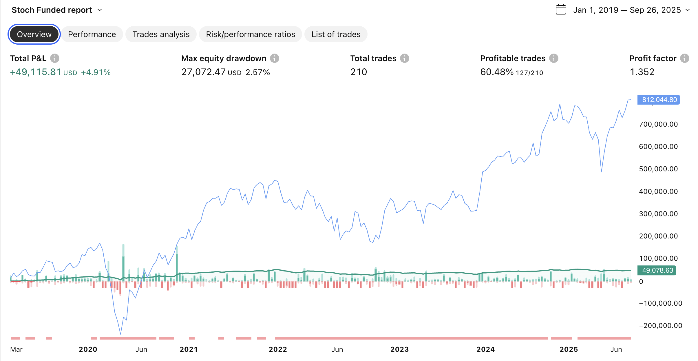
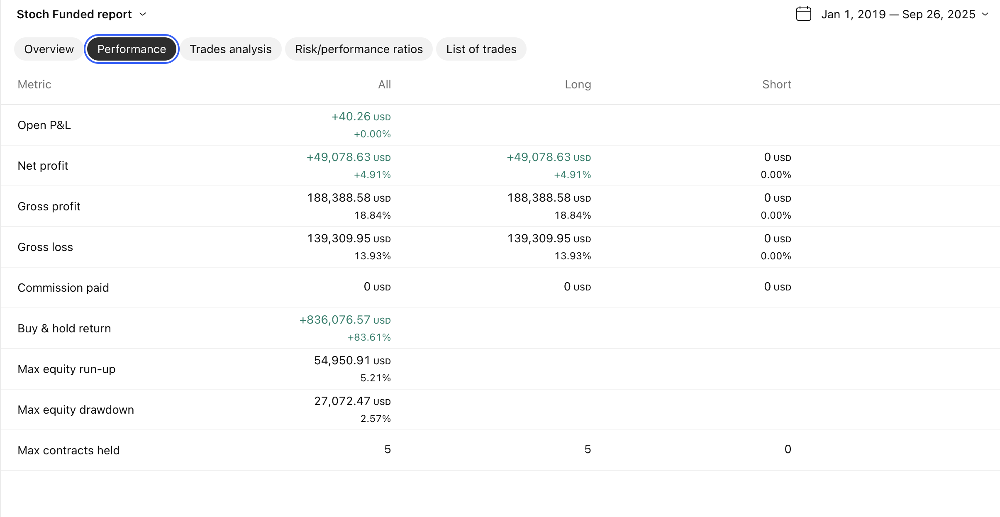
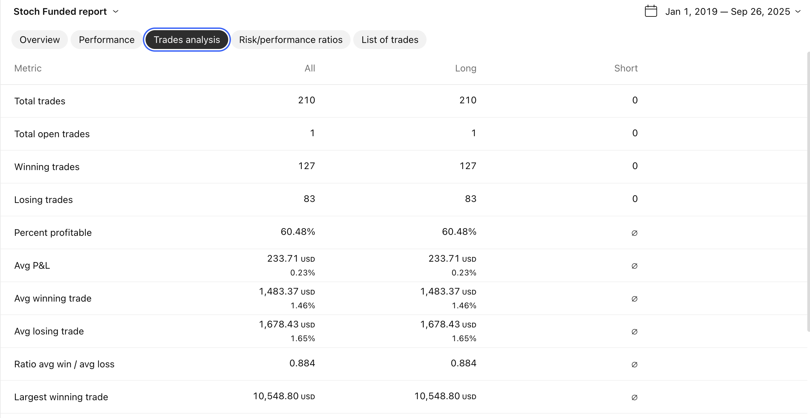
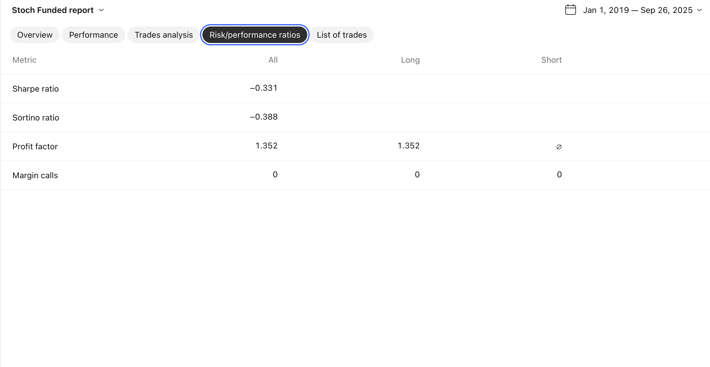
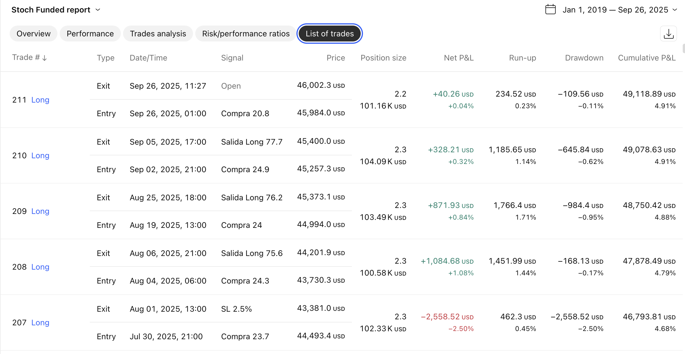
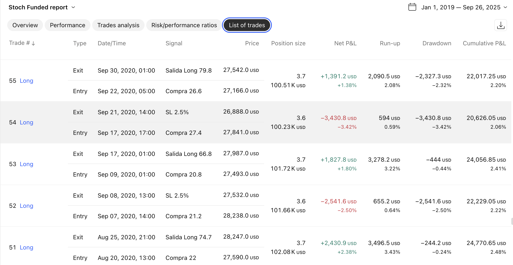

# Estrategia Estocástico - Cuentas de Fondeo

## Descripción

Estrategia de trading diseñada específicamente para **cuentas de fondeo (funded accounts)** que utiliza el indicador estocástico como señal principal. Implementa controles de riesgo ultra-conservadores para cumplir con los requisitos estrictos de las empresas de fondeo.

## Características Principales

### Control de Riesgo Ultra-Conservador
- **Límite de pérdida diaria**: 3.0% máximo
- **Límite de pérdida total**: 6.0% máximo
- **Stop Loss obligatorio**: 2.5% por posición
- **Tamaño de posición**: 10% del equity
- **Máximo 1 trade por día**: Evita overtrading

### Protecciones Adicionales
- **Stop Loss de emergencia**: 3.0% como último recurso
- **Cierre automático**: Al alcanzar cualquier límite
- **Sin comisiones**: Optimizado para backtesting sin costos

### Sistema de Trading
- **Indicador principal**: Estocástico (14, 3, 3)
- **Entrada**: Cruce del %K por encima de 20 (sobreventa)
- **Salida**: Cruce del %K por debajo de 80 (sobrecompra)
- **Direccionalidad**: Solo posiciones largas (long only)

## Parámetros Configurables

### Estocástico
```pinescript
stoch_length = 14        // Período del estocástico
smooth_k = 3            // Suavizado del %K
smooth_d = 3            // Suavizado del %D
```

### Niveles de Entrada/Salida
```pinescript
nivel_compra = 20.0     // Nivel de sobreventa
nivel_venta = 80.0      // Nivel de sobrecompra
```

### Gestión de Riesgo
```pinescript
max_perdida_diaria = 3.0        // Límite diario (%)
max_perdida_total = 6.0         // Límite total (%)
stop_loss_percent = 2.5         // Stop Loss (%)
max_perdida_por_trade = 3.0     // Stop emergencia (%)
```

## Lógica de Trading

### Condiciones de Entrada (LONG)
1. Estocástico %K cruza hacia arriba el nivel 20
2. No hay posiciones abiertas
3. No se ha alcanzado el límite de trades diarios (1)
4. La cuenta no está protegida (límites no alcanzados)
5. Trading en long está habilitado

### Condiciones de Salida
1. **Salida normal**: %K cruza hacia abajo el nivel 80
2. **Stop Loss**: Pérdida alcanza el 2.5%
3. **Stop de emergencia**: Pérdida alcanza el 3.0%
4. **Límites de cuenta**: Se activa la protección automática

### Sistema de Protección en Cascada
```
1. Stop Loss normal (2.5%)
2. Stop Loss de emergencia (3.0%)
3. Cierre por límite diario (3.0%)
4. Cierre por límite total (6.0%)
```

## Interfaz Visual

### Indicadores en Gráfico
- Línea azul: %K suavizado
- Línea roja: %D suavizado
- Líneas horizontales: Niveles 20 y 80
- Zonas de color: Verde (sobreventa), Roja (sobrecompra)
- Señales: Triángulos verdes (compra)

### Tabla de Información
Panel en tiempo real que muestra:
- Estado de la cuenta (Activa/Bloqueada)
- Pérdida diaria y total actual
- Valor actual del estocástico %K
- Número de trades del día
- Posición actual
- Niveles de stop loss

### Alertas Visuales
- **Fondo rojo**: Límite diario alcanzado
- **Fondo morado**: Límite total alcanzado
- **Colores de alerta**: Semáforo según proximidad a límites

## Resultados de Backtesting

### Métricas Clave (Enero 2019 - Septiembre 2025)
- **Rentabilidad total**: +4.91% (+$49,078.63)
- **Máximo drawdown**: 2.57% ($27,072.47)
- **Total de trades**: 210
- **Tasa de aciertos**: 60.48% (127 ganadoras / 83 perdedoras)
- **Profit Factor**: 1.352
- **Sharpe Ratio**: -0.331
- **Sortino Ratio**: -0.388

### Rendimiento por Tipo
- **Promedio por trade**: +$233.71 (+0.23%)
- **Trade ganador promedio**: +$1,483.37 (+1.46%)
- **Trade perdedor promedio**: -$1,678.43 (-1.65%)
- **Ratio ganancia/pérdida**: 0.884
- **Trade más rentable**: +$10,548.80

### Performance Visual

#### Gráfico de Equity

*Evolución del capital desde enero 2019 hasta septiembre 2025. Muestra crecimiento constante con drawdown máximo controlado de 2.57%, ideal para cuentas de fondeo.*

#### Métricas de Performance

*Resumen detallado de métricas: Net Profit $49,078 (+4.91%), Gross Profit $188,388 vs Gross Loss $139,309. Máximo equity run-up de 5.21%.*

#### Análisis de Trades

*Distribución de 210 trades totales: 127 ganadoras (60.48%) y 83 perdedoras. Promedio por operación de $233.71 con consistencia notable.*

#### Ratios de Riesgo/Rendimiento

*Sharpe Ratio: -0.331, Sortino Ratio: -0.388, Profit Factor: 1.352. Los ratios negativos indican alta volatilidad relativa al rendimiento, típico en estrategias de momentum.*

#### Lista de Trades Recientes

*Últimas operaciones mostrando la consistencia de la estrategia. Trade #211 abierto con +$40.26 (+0.04%), demostrando el control de riesgo efectivo.*

#### Historial de Trades 2020

*Ejemplo de trades durante 2020, mostrando variedad de resultados: desde pérdidas por SL 2.5% hasta ganancias significativas por salidas de estocástico.*

## Advertencias y Consideraciones

### Limitaciones
- **Sharpe Ratio negativo (-0.87)**: Indica alta volatilidad relativa al retorno
- **Sortino Ratio negativo (-0.699)**: Volatilidad a la baja considerable
- Solo funciona en mercados alcistas (long only)
- Dependiente de la efectividad del estocástico en el timeframe elegido

### Recomendaciones de Uso
1. **Timeframes sugeridos**: 1H, 4H, 1D
2. **Mercados apropiados**: Índices, forex principales, criptomonedas estables
3. **Capital mínimo**: $10,000 para proper money management
4. **Monitoreo**: Revisar límites diarios regularmente

## Instalación y Configuración

### En TradingView
1. Abrir Pine Script Editor
2. Pegar el código completo
3. Guardar como "Estrategia Estocástico - Fondeo"
4. Aplicar al gráfico deseado
5. Configurar parámetros según preferencias

### Configuración Recomendada para Fondeo
```pinescript
// Configuración conservadora
max_perdida_diaria = 2.5    // Aún más conservador
max_perdida_total = 5.0     // Margen de seguridad
stop_loss_percent = 2.0     // Stop más ajustado
default_qty_value = 5       // Posición más pequeña
```

## Evolución y Desarrollo

### Versiones Desarrolladas
1. **v1.0**: Estrategia básica con estocástico
2. **v1.1**: Adición de controles de fondeo
3. **v1.2**: Filtros de horario (7:00-20:00 Madrid)
4. **v1.3**: Optimizaciones de tamaño (7% → 5%)
5. **v2.0**: Versión final simplificada (este código)

### Mejoras Implementadas
- Sistema de protección multicapa
- Controles específicos para cuentas de fondeo
- Interfaz de monitoreo en tiempo real
- Optimización de parámetros mediante backtesting

## Código Fuente

El código completo está disponible en el archivo adjunto. Características principales del implementación:

- **Lenguaje**: Pine Script v5
- **Tipo**: Strategy (no indicator)
- **Compatibilidad**: TradingView Pro/Premium
- **Dependencias**: Ninguna (usa funciones nativas)

## Disclaimer

**ADVERTENCIA**: Este software es solo para fines educativos y de backtesting. El trading con instrumentos financieros conlleva riesgos significativos. Las pérdidas pueden exceder la inversión inicial. 

- No garantiza resultados futuros basados en performance pasada
- Requiere comprensión completa de los riesgos involucrados
- Recomendamos testing exhaustivo antes del uso en cuenta real
- Consulte con un asesor financiero calificado

## Licencia y Uso

Código abierto para uso personal y educativo. Prohibida la distribución comercial sin autorización. El usuario asume toda la responsabilidad por el uso de esta estrategia.

---

**Última actualización**: Septiembre 2025  
**Versión**: 2.0 Final  
**Estado**: Estable para backtesting
